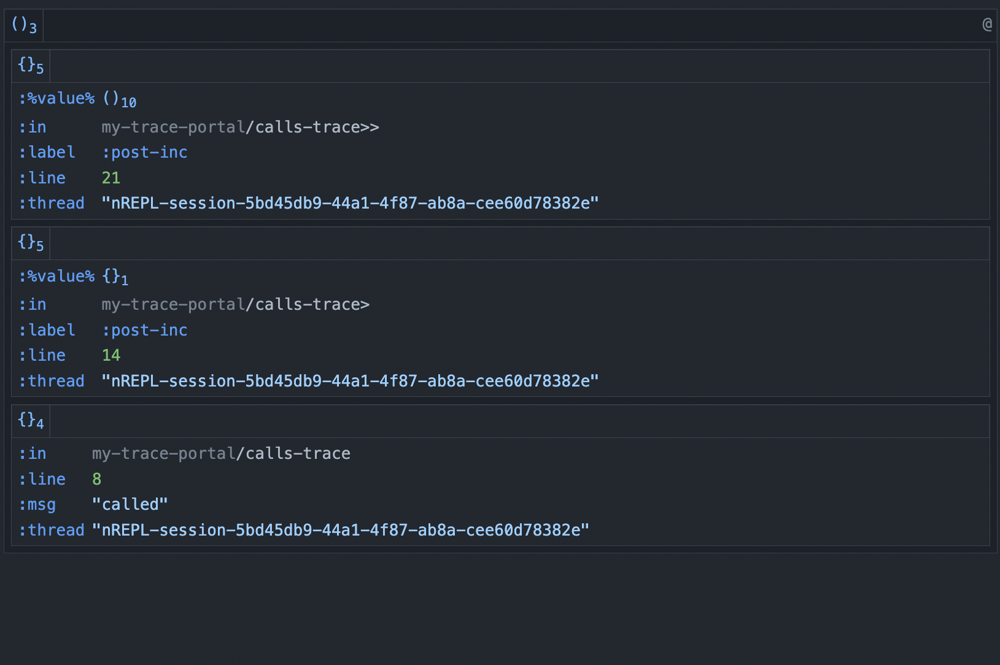

Since I started with Debugging clojure, I have used to use `prn` to see results. I also used `#dbg` in calva, which looks like a traditional debug mode and good as well.
However, I'd like to improve my debugging with REPL driven development and be more productive. I have searched for things and end up with finding nice combinations, [trace](trace) + [portal](portal).

## Prerequisite
Understanding [tap>](tap)

## Trace
[trace](trace) is written by [hlship](https://github.com/hlship) and a README contains motivations. I find it strong to leave trace codes in production because the debug is traced when the set-up is on. The other point is it let us know where it is traced. If you experienced with `tap>`, it's hard to trace a bunch of values in a tap.

## Portal
[portal] is written by [djblue](https://github.com/djblue). It connects to REPL and can navitate data. Obviously, it's related with UI stuff and navigation tool.


### 1. Using prn
Easy approach to debug.
```clojure
(defn inspector
  [x]
  (prn x)
  x)

(defn calls
  []
  (inspector "called"))

(defn calls>
  []
  (-> {:value 1}
      (update :value inc)
      inspector
      (assoc :after true)))

(defn calls>>
  []
  (->> (range 10)
       (map inc)
       inspector
       (partition 2)))

(comment
  (calls)
  ;; "called"
  (calls>)
  ;; {:value 2}
  (calls>>)
  ;; (1 2 3 4 5 6 7 8 9 10)
  )
```

### 2. Using tap>
`tap>` is always good enough but a little bit hard to label.
```clojure
(def debug-atom (atom []))
(add-tap (fn [value] (swap! debug-atom #(conj % value))))

(comment
  (tap> 1)
  @debug-atom
  ;; [1]

  (tap> {:age  31
         :name "jungwoo"})
  @debug-atom)
  ;; [1 {:age  31
         :name "jungwoo"}]
```


### 3. Using trace
This sample code is from [here](https://github.com/hlship/trace/blob/main/test/net/lewisship/trace_test.clj). I've forked this repo and changed just few line to make it easy threading macro.
```clojure
(defn calls-trace
  []
  (trace :msg "called"))

(defn calls-trace>
  []
  (-> {:value 1}
      (update :value inc)
      (trace> :label :post-inc)
      (assoc :after true)))

(defn calls-trace>>
  []
  (->> (range 10)
       (map inc)
       (trace>> :label :post-inc)
       (partition 2)))


(comment
  (calls-trace)
;; no output
  (trace/setup-default)
;; Reload this NS to test the remainder:
  (calls-trace)
;;   {:in     my-only-trace/calls-trace
;;    :line   7
;;    :thread "nREPL-session-90a76836-b2ce-4d07-86db-23db11474218"
;;    :msg    "called"}
  (calls-trace>)
;;   {:in      my-only-trace/calls-trace>
;;    :line    13
;;    :thread  "nREPL-session-90a76836-b2ce-4d07-86db-23db11474218"
;;    :%value% {:value 2}
;;    :label   :post-inc}
  (calls-trace>>)
;;   {:in      my-only-trace/calls-trace>>
;;    :line    20
;;    :thread  "nREPL-session-90a76836-b2ce-4d07-86db-23db11474218"
;;    :%value% (1 2 3 4 5 6 7 8 9 10)
;;    :label   :post-inc}
  )
```

### 4. Using trace + portal
As I mentioned, portal is the UI tool with `add-tap` so example code is basically same but we need to launch portal like below.
```clojure
(comment
  (calls-trace)
  (trace/setup-default)
;; Reload this NS to test the remainder:
  (do (ns dev)
      (def portal ((requiring-resolve 'portal.api/open)
                   {:launcher                     :vs-code
                    :portal.launcher/window-title (System/getProperty "user.dir")}))
      (add-tap (requiring-resolve 'portal.api/submit)))
  (calls-trace)
  (calls-trace>)
  (calls-trace>>))
```
I was on VS code so the new window is shown up!



## What should I use?
It really depends on cases. I use all of those. This is [an whole example code](https://github.com/jungwookim/debugging-clojure-example).

[portal]:https://github.com/djblue/portal
[trace]:https://github.com/hlship/trace
[tap]:https://clojuredocs.org/clojure.core/tap%3E