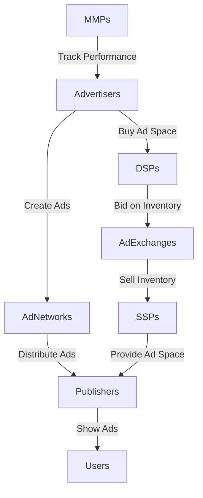
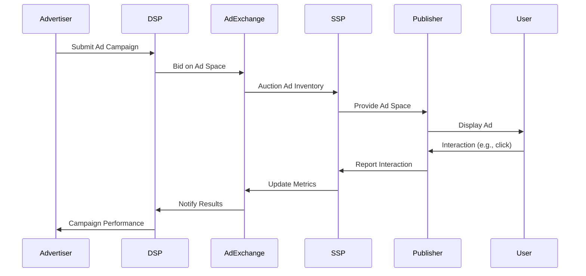

Title: Online ads (1)
Date: 2025-07-26
Tags: Advertisement, Marketing, Ads

# How Online Ads Really Work

I'm a Senior Software Engineer at Unity, working on Tapjoy Offerwall, a ad solution for mobile games and apps. In this post, I want to demysify how online ads work, especially in the context of mobile games and app. It won't cover every detail but will give you a solid understanding of the ecosystem, the players involved, and how it all comes together. Plus, I won't explain Offerwall itself, but rather focus on the broader ad tech landscape that makes it possible.

## Introduction: Ads Are Everywhere — But How Do They Work?

When you play games or browse the web, you see ads everywhere. I knew that ads are everywhere but I didn't know how they really work even though I have been working on the Ads team. This article is for those who want to understand the ad tech ecosystem. I will explain key actors, how they interact, and the techonology behind it with top-down approach. I wish you will get a better understanding of how online ads works after reading this post.

---

## The Big Picture: Online Advertising Ecosystem

There are key players in the online advertising ecosystem that work together to deliver ads to users. Here's a high-level overview:

- Advertisers: Companies that want to promote their products or services.
- Publishers: Websites or apps that display ads to their users.
- Ad Networks: Middlemen that connect advertisers with publishers.
- DSPs (Demand Side Platforms): Tools that help advertisers buy ad space programmatically.
- SSPs (Supply Side Platforms): Tools that help publishers sell ad space programmatically.
- Ad Exchanges: Marketplaces where DSPs and SSPs transact.
- MMPs (Mobile Measurement Partners): Companies that track ad performance and user acquisition.

That's a lot of jargon, but don't worry. I'll break it down in the following sections. Before that, here's a high-level diagram of the ecosystem:

